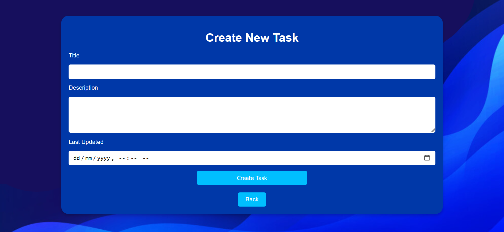

ToDo List Application

This repository contains a simple ToDo List application built with Node.js, Express, EJS, and a touch of client-side JavaScript. The app allows users to create, view, update, delete, and mark tasks as complete.

Features:

    Task Creation: Users can add new tasks with titles, descriptions, and last updated timestamps.
    Task List: All tasks are displayed in a list format.
    Task Completion: Users can mark tasks as complete using checkboxes.
    Task Update: Existing tasks can be updated, including their completion status.
    Task Deletion: Tasks can be deleted from the list.
    Search: The home page allows users to search for tasks by keywords in the title.
    Data Persistence: Task data is stored in a file, ensuring persistence between sessions.

Getting Started:

    Clone the Repository:

    git clone https://github.com/your-username/todo-list.git

Install Dependencies:

cd todo-list
npm install

Run the Server:

    npm app.js
    Access the Application: Open your web browser and navigate to http://localhost:8080.

Key Technologies:

    Node.js: The runtime environment for the server.
    Express: A popular Node.js web framework for building web applications.
    EJS: A templating engine for rendering dynamic HTML.
    JSON: Used to store task data.

Sample Images -
1. start page 

2. Tasks list 

3. Create new tasks - 

for more infomation , visit the site .

This project provides a basic foundation for building a ToDo List application. It's a great starting point for learning web development concepts and experimenting with different technologies.